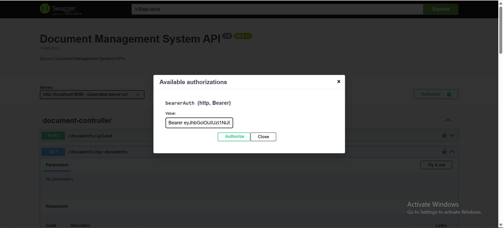
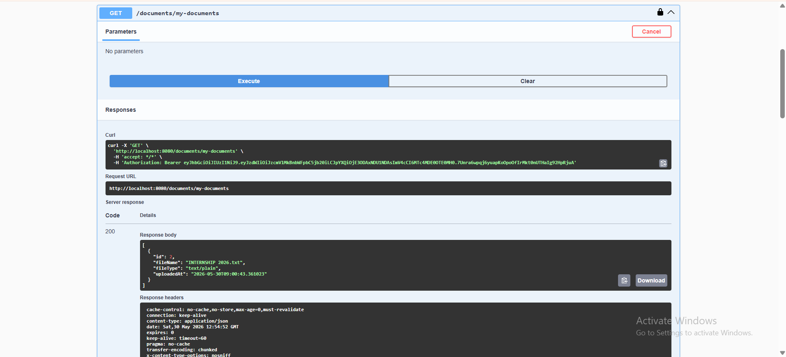

# Secure Document Management System

A secure backend application built using Spring Boot that allows users to upload, download, manage, and securely access documents using JWT Authentication and Role-Based Authorization.

---

## 🚀 Features

* JWT Authentication & Authorization
* Spring Security Integration
* Role-Based Access Control (USER / ADMIN)
* Secure File Upload & Download
* Document Delete Functionality
* User-Specific Document Access
* Global Exception Handling
* Request Validation
* Swagger/OpenAPI Documentation
* Professional Logging System
* Structured API Responses

---

## 🛠 Tech Stack

* Java 21
* Spring Boot
* Spring Security
* JWT (JSON Web Token)
* Spring Data JPA
* MySQL
* Maven
* Swagger / OpenAPI
* Lombok

---

## 🔥 Highlights

- Enterprise-level Spring Boot backend project
- Secure JWT Authentication & Authorization
- Role-Based Access Control
- File Upload & Download APIs
- Swagger API Documentation
- Professional Backend Architecture

---

## 📂 Project Structure

```text
src/main/java/com/sreeram/documentmanagementsystem

├── config
├── controller
├── dto
├── entity
├── exception
├── repository
├── security
├── service
```

---

## 🔐 Authentication APIs

### Register User

POST `/auth/register`

### Login User

POST `/auth/login`

---

## 📄 Document APIs

### Upload Document

POST `/documents/upload`

### Get My Documents

GET `/documents/my-documents`

### Download Document

GET `/documents/download/{id}`

### Delete Document

DELETE `/documents/delete/{id}`

---

## 👨‍💻 Admin APIs

### Admin Dashboard

GET `/admin/dashboard`

---

## 📘 Swagger Documentation

Swagger UI:

```text
http://localhost:8080/swagger-ui/index.html
```

---
🔗 GitHub Repository:
https://github.com/SreeRam2526/secure-document-management-system

## ⚙️ Setup Instructions

### 1️⃣ Clone Repository

```bash
git clone https://github.com/SreeRam2526/secure-document-management-system.git
```

### 2️⃣ Configure MySQL

Create database:

```sql
CREATE DATABASE document_management_system;
```

### 3️⃣ Configure application.properties

```properties
spring.datasource.url=jdbc:mysql://localhost:3306/document_management_system
spring.datasource.username=root
spring.datasource.password=YOUR_PASSWORD
```

### 4️⃣ Run Application

```bash
mvn spring-boot:run
```

---
## 📸 API Screenshots

### Swagger UI


### JWT Authorization


### Upload API

```


## 🔥 Key Learning Outcomes

* Secure Backend Development
* JWT Authentication
* Role-Based Authorization
* REST API Design
* File Handling in Spring Boot
* Exception Handling
* Swagger API Documentation
* Backend Architecture

---

## 📌 Future Improvements

* AWS S3 Integration
* Docker Deployment
* Cloud File Storage
* Pagination & Search
* Email Notifications

---

## 👨‍💻 Author

SreeRam

Backend & AI Engineering Enthusiast
